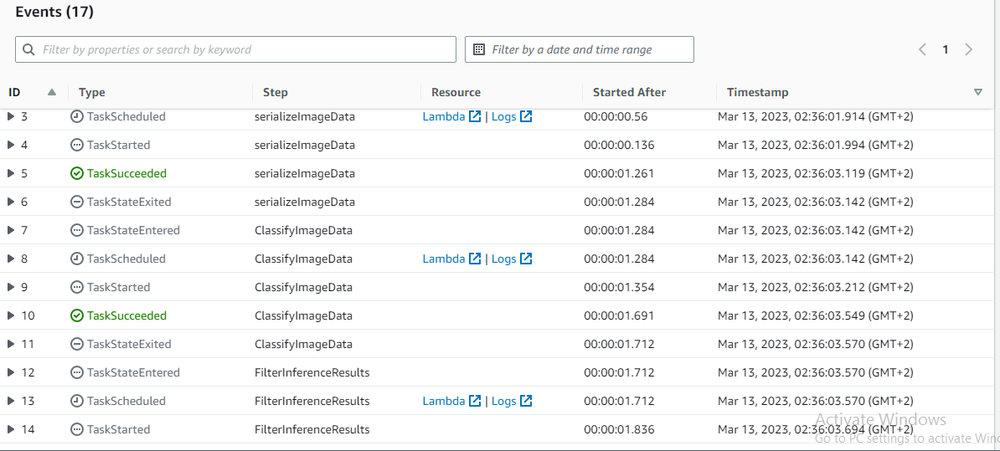
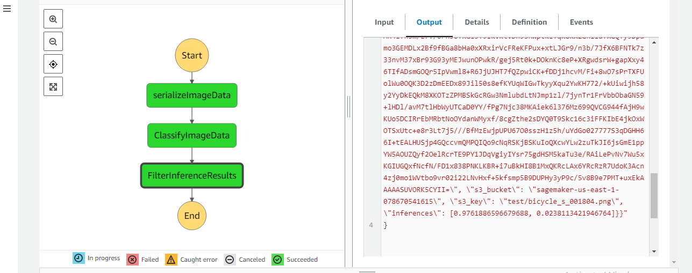
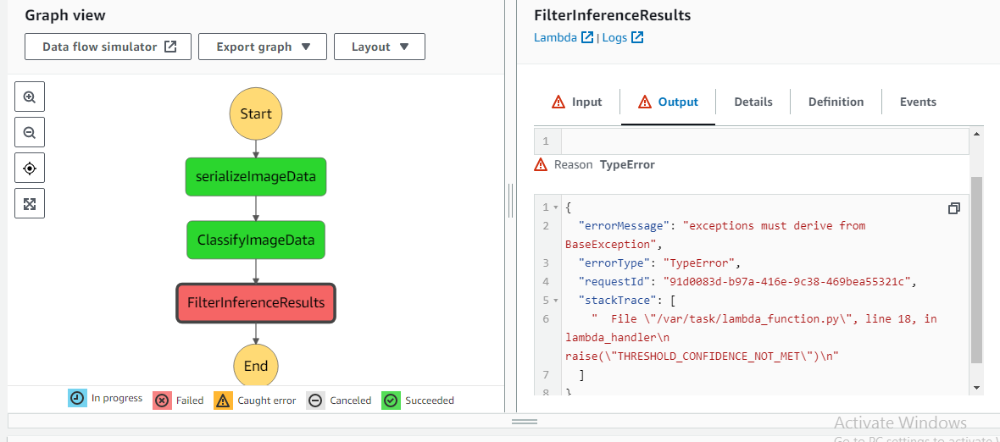

# Build a ML Workflow For Scones Unlimited On Amazon SageMaker
 This project is a part of the assessment in the Udacity's AWS Machine Learning Engineer Nanodegree Program.
 
 # Project Overview:
 
 In this project, I've used AWS Sagemaker to build an image classification model that can tell bicycles apart from motorcycles. And I've deployed the model, using AWS Lambda functions to build supporting services, and AWS Step Functions to compose the model and services into an event-driven application.
 
 # Project Steps Overview:
 
 * Step 1: Data staging
 * Step 2: Model training and deployment
 * Step 3: Lambdas and step function workflow
 * Step 4: Testing and evaluation
 * Step 5: Optional challenge
 * Step 6: Cleanup cloud resources
 
 # Building a State Machine via AWS Step Functions:
 
 * Execution Flow of the Step Function

* Step Function Graph (that met inference threshold)

* Step Function Graph (that not met inference threshold)

 

 
 
